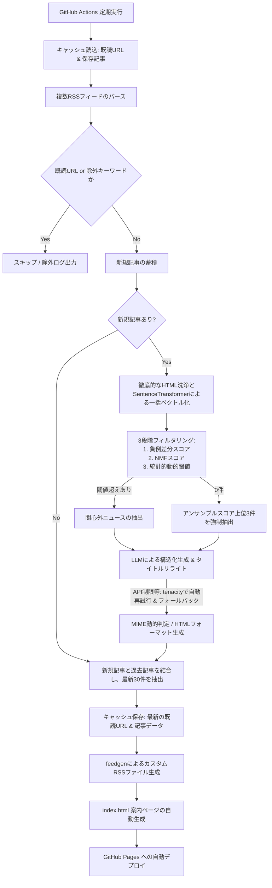

<h1 align="center">bubble-breaker</h1>

    <strong>指定したニュースメディアのRSSから、 ユーザーの関心領域外（フィルターバブル外）のニュースを自動抽出し、 LLM(Gemini API)で構造化して配信するカスタムフィード</strong>

  
  
  
  
  
  

English version available → [README.md](README.md)

## 1. システム概要

現代の情報収集におけるフィルターバブル（推薦アルゴリズムによる関心の偏り）を打破するための、逆フィルタリング型ニュース配信システムです。

ユーザーが設定した「興味ありクラスタ」と「興味なしクラスタ」を利用し、①`負例クラスタ差分スコア`、②`NMFトピックモデル`、③`統計的動的閾値`を用いた3段階フィルタリングによって、関心外のニュースを抽出します。抽出された記事はLLMを利用して、タイトルリライト、記事を「何があったか」「背景」「影響」「興味との接点」の4セクションに構造化し、GitHub Pages経由で新たなRSSフィード（XML）及びインデックスページとして配信します。

> [!WARNING]
> 本システムが生成するLLMによる解説や要約は、ユーザーに専門外の分野に対する興味・関心を持たせるための「導入」および「補完」を目的としています。
>事実関係については Google Search Grounding 等を用いて精度向上を図っていますが、LLM特有のハルシネーションが含まれる可能性があります。
> **正確な事実関係や詳細については、必ずフィード内のリンクから本来のニュース記事（元記事）を通読することを前提に、ご確認ください。**

## 2. システムフロー

🔍 <b>クリックしてシステムフロー図を表示</b>

## 3. 主な機能

* 3段階の高度な逆フィルタリングアルゴリズム    
    単一のテキスト比較ではなく、「興味ありクラスタ」と「興味なしクラスタ」の類似度差分（負例差分）、NMF（非負値行列因子分解）を用いた潜在トピック分析、および統計的動的閾値（`mean + K_SIGMA*std`）をアンサンブルすることで、高精度に関心外の記事を特定します。

* Google Search Groundingによる時事情報の補完    
    Gemini APIの検索連携機能を有効化。LLMの事前学習知識に頼らず、最新の時事情報や普遍的な構造的背景を正確に補完した解説を生成します。

* 常時ストック方式によるフィード維持    
    actions/cache を利用し、処理済みURL（最大500件）と生成済み記事データをJSONで保存。重複処理を防ぎつつ、常に最新30件の記事を維持して出力するため、新規記事が0件のタイミングでも過去の記事が消滅せず安定した配信を実現します。

* APIレートリミット対策（堅牢なエラーハンドリング）    
    無料API枠（15 RPM等）の超過を防止するため、LLM生成部に5秒間の事前スロットリング（待機処理）を導入。さらに tenacity を用いた指数的バックオフにより、一時的な通信エラーにも最大5回まで自動再試行します。万が一の生成失敗時も元記事の要約でフォールバックし、システムを止めません。

* RSS表示の最適化    
    記事概要に元ソース名と類似度スコアを明記。画像URLから動的にMIMEタイプを判定する堅牢なenclosure対応や、インラインCSSによるHTML余白最適化を行っています。

## 4. テクニカルスタック

* 言語: Python 3.10
* LLM SDK: google-genai
* 生成モデル: gemini-3.1-flash-lite (Google Search Grounding有効)
* 埋め込みモデル: sentence-transformers (intfloat/multilingual-e5-small)
* リトライ制御: tenacity
* RSSパース・生成: feedparser, feedgen
* インフラ: GitHub Actions (CI/CD), GitHub Pages (静的ホスティング)

## 5. リポジトリ構成

* `main.py`: RSS取得、フィルタリング、LLM解説生成、ファイル出力までの全パイプラインを担うメインスクリプト
* `processed_urls.json`: （自動生成）既読URLリストと直近の出力記事を保持するキャッシュファイル
* `requirements.txt`: 依存パッケージ一覧
* `.github/workflows/generate-rss.yml`: 定期実行およびキャッシュ制御を行うGitHub Actions定義ファイル

## 6. セットアップ手順

1. **リポジトリの準備**

   本リポジトリを自身のGitHubアカウントにクローン、またはフォークして作成する。

2. **各種APIキー・トークンの取得**

   * [Google AI Studio](https://aistudio.google.com/) から Gemini API キーを取得。
   * [Hugging Face](https://huggingface.co/settings/tokens) から Access Token (Read権限) を取得。

3. **GitHub Secrets の設定**

   GitHubリポジトリの `Settings` > `Secrets and variables` > `Actions` に、以下の環境変数を登録する。
   * `API_KEY1`: 取得したGemini APIキー
   * `HF_TOKEN1`: 取得したHugging Faceトークン

4. **GitHub Variables / 環境変数の設定 (任意)**

   * `USE_GROUNDING`: "true" に設定すると、LLMの生成においてGoogle Search Groundingが有効になります（APIの利用制限にご注意ください）。

5. **GitHub Pages の有効化**

    GitHubリポジトリの `Settings` > `Pages` にて、Build and deployment の Source を「GitHub Actions」などに適切に設定する。

6. **ソースコードのカスタマイズ**

    `main.py` 内の以下の変数を、目的に応じてカスタマイズしてください。
   * `SOURCE_RSS_URLS`: 取得元となるニュースメディアのRSS URLリスト
   * `INTEREST_TEXTS`: 自身の現在の興味領域（興味ありクラスタ）
   * `DISINTEREST_TEXTS`: 遠ざけたい領域（興味なしクラスタ）
   * `EXCLUDE_KEYWORDS`: 有料記事などを除外するためのキーワードリスト
   * `K_SIGMA` / `N_TOPICS`: フィルタリングの統計的閾値やトピック数の調整

## 7. 利用方法

GitHub Actionsの実行が正常に完了すると、GitHub Pages環境へ自動デプロイされ、以下のURLに案内ページ（index.html）が生成されます。

`https://[GitHubユーザー名].github.io/[リポジトリ名]/`

同ディレクトリ内の rss.xml を、FeedlyやNetNewsWireなどの任意のRSSリーダーアプリに登録して購読してください。

## LICENSE

MIT
