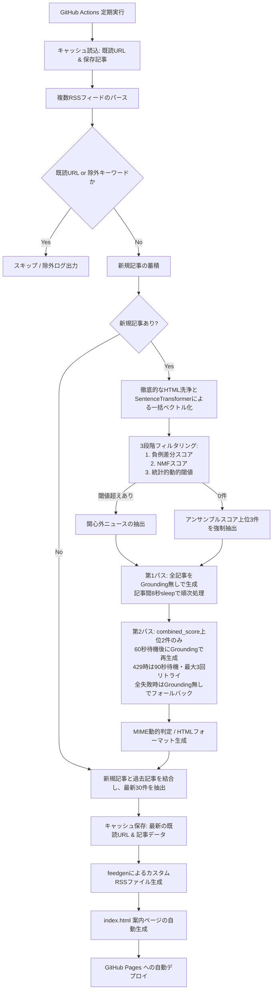

<h1 align="center">bubble-breaker</h1>

<p align="center">
    <strong>指定したニュースメディアのRSSから、 ユーザーの関心領域外（フィルターバブル外）のニュースを自動抽出し、 LLM(Gemini API)で構造化して配信するカスタムフィード</strong>
</p>

<p align="center">
  <a href="https://www.python.org/downloads/release/python-3100/">
    
  </a>
  <a href="https://github.com/ph-cookie/bubble-breaker/actions">
    
  </a>
  <a href="https://ph-cookie.github.io/bubble-breaker/">
    
  </a>
  <a href="https://aistudio.google.com/">
    
  </a>
  <a href="https://huggingface.co/intfloat/multilingual-e5-small">
    
  </a>
  <a href="https://opensource.org/licenses/MIT">
    
  </a>
</p>

English version available → [README.md](README.md)


## 1. システム概要

現代の情報収集におけるフィルターバブル（推薦アルゴリズムによる関心の偏り）を打破するための、逆フィルタリング型ニュース配信システムです。

ユーザーが設定した「興味ありクラスタ」と「興味なしクラスタ」を利用し、①`負例クラスタ差分スコア`、②`NMFトピックモデル`、③`統計的動的閾値`を用いた3段階フィルタリングによって、関心外のニュースを抽出します。抽出された記事はLLMを利用して、タイトルリライト、記事を「何があったか」「背景」「影響」「興味との接点」の4セクションに構造化し、GitHub Pages経由で新たなRSSフィード（XML）及びインデックスページとして配信します。

> [!WARNING]
> 本システムが生成するLLMによる解説や要約は、ユーザーに専門外の分野に対する興味・関心を持たせるための「導入」および「補完」を目的としています。
> 事実関係については Google Search Grounding 等を用いて精度向上を図っていますが、LLM特有のハルシネーションが含まれる可能性があります。
> **正確な事実関係や詳細については、必ずフィード内のリンクから本来のニュース記事（元記事）を通読することを前提に、ご確認ください。**

## 2. システムフロー

<details>
<summary style="color: #666; font-size: 0.9em; cursor: pointer;">
🔍 <b>クリックしてシステムフロー図を表示</b>
</summary>



</details>

## 3. 主な機能

* **3段階の高度な逆フィルタリングアルゴリズム**

    単純に「興味ある分野から遠い記事」を選ぶだけでは、「企業」「変化」「問題」のような汎用語がIT記事にも政治記事にも登場するため、誤判定が多発します。そこで以下の3段階の指標を組み合わせています。

    | # | 指標 | 何を測るか | 解決する問題 |
    |---|------|-----------|------------|
    | 1 | **負例差分スコア** | 興味なし寄りの度合いを「興味あり・なし両方向の類似度の差」で定量化 | 汎用語による誤判定を、正例・負例の対比で相殺する |
    | 2 | **NMFスコア** | 全記事を横断的に分解した潜在トピックの中で、記事がどのテーマ群に属するか | 単語レベルでは捉えにくい文脈・話題の性質を補完する |
    | 3 | **統計的動的閾値** | その実行時の記事群における最終スコアの相対的な位置づけ | 日ごとのニュース量・偏りに関わらず一定の抽出精度を保つ |

    これらを組み合わせたアンサンブルスコアにより、単一指標では取りこぼしやすい「見た目はIT記事に近いが話題は全く別」という記事を適切に捉えます。

    <details>
    <summary style="color: #666; font-size: 0.9em; cursor: pointer; margin-top: 0.5em;">
    🔍 <b>各フィルタの詳細説明</b>
    </summary>

    **STEP 1 ｜ ベクトル類似度による差分スコア**

    記事テキストを多言語埋め込みモデル（`multilingual-e5-small`）でベクトル化します。次に、あらかじめ定義した `INTEREST_TEXTS`（興味ありクラスタ）と `DISINTEREST_TEXTS`（興味なしクラスタ）のそれぞれとのコサイン類似度を計算します。

    ```
    差分スコア = max(興味なしクラスタとの類似度) − max(興味ありクラスタとの類似度)
    ```

    この値が大きいほど、記事が「興味なし寄りかつ興味あり寄りでない」ことを意味します。単純に興味ありとの距離だけを見るのではなく、両方向の距離の差を取ることで、IT・政治どちらの記事にも頻出する「企業」「変化」「問題」といった汎用語による誤判定を抑制します。

    ---

    **STEP 2 ｜ NMFによる潜在トピックスコア**

    全記事のテキストを文字n-gram（2〜3文字）でTF-IDF行列に変換し、NMF（非負値行列因子分解）でN個の潜在トピックに分解します。NMFとは、行列を「トピックと単語の関係行列」と「記事とトピックの関係行列」の積に分解する手法です。各トピックは記事群の中で共起しやすい語のまとまりとして自動的に発見されます。

    次に、各トピックの代表語をembedderでベクトル化し、`INTEREST_TEXTS` との類似度を計算。その反転値（`1 − 類似度`）を「トピックの非興味度」とし、記事ごとに所属トピックの非興味度を割合で加重平均したものをNMFスコアとして出力します。


    $$\text{トピック}k\text{の非興味度} = 1 - \max(\text{INTEREST\_TEXTSとのコサイン類似度})$$
    
    $$\text{記事}i\text{のNMFスコア} = \sum_{k} \left( \text{記事}i\text{におけるトピック}k\text{の割合} \times \text{トピック}k\text{の非興味度} \right)$$


    STEP 1 が記事単体をそのままベクトル化して判定するのに対し、STEP 2 は全記事を横断的に分析した潜在的なトピック構造を通じて判定します。両者を組み合わせることで、単語レベルの類似性と話題レベルの構造的な差異の両面を捉えられます。

    ---

    **STEP 3 ｜ 統計的動的閾値による選別**

    STEP 1・2 のスコアをそれぞれ sigmoid 関数で 0〜1 に変換し（差分スコアのゼロ基準を保持するため min-max ではなく sigmoid を使用）、重みパラメータ α・β で加重合算します。

    ```
    最終スコア = α × STEP1スコア + β × STEP2スコア
    ```

    **α・β について：** それぞれ STEP 1・STEP 2 の寄与度を表す重みです。デフォルトは均等（α = β = 0.5）で、両指標を同等に扱います。「差分スコアの方が精度が高い」と感じる場合は α を大きく、「NMFの方が効いている」と感じる場合は β を大きくすることで調整できます。合計を 1.0 に保つことを推奨します。

    次に、全記事の最終スコアの平均（μ）と標準偏差（σ）を計算し、閾値を動的に決定します。

    ```
    閾値 = μ + K × σ
    ```

    **K について：** 閾値の厳しさを制御するパラメータです。デフォルト（K = 0.5）では、スコアが平均より 0.5σ 以上高い記事が抽出対象になります。K を大きくするほど厳選され抽出件数が減り、小さくするほど緩く多く抽出されます。固定値ではなく実行時の記事群の統計から閾値を導出するため、日ごとにニュースの偏りが変化しても安定した抽出ができます。

    </details>

* **Google Search Groundingによる選択的な時事情報補完**

    クォータ消費を最小限に抑えるため、2段階方式を採用しています。第1パスでは全記事をGrounding無しで安定生成し、続く第2パスではcombined_scoreが最上位のN件（デフォルト2件）に絞り、60秒の事前待機後にGroundingを適用して最新情報を補完します。Grounding時に429が発生した場合は90秒待機後に最大3回リトライし、全試行失敗時はGrounding無しの生成結果を維持するフォールバック構造を持ちます。

* **常時ストック方式によるフィード維持**

    `actions/cache` を利用し、処理済みURL（最大500件）と生成済み記事データをJSONで保存。重複処理を防ぎつつ、常に最新30件の記事を維持して出力するため、新規記事が0件のタイミングでも過去の記事が消滅せず安定した配信を実現します。

* **APIレートリミット対策（堅牢なエラーハンドリング）**

    第1パスでは記事間に8秒のsleepを挿入してレート超過を防止。第2パスのGrounding試行前は60秒待機することでクォータ回復を待ちます。非Grounding生成では `tenacity` による指数的バックオフで最大5回まで自動再試行し、万が一の生成失敗時も元記事の要約でフォールバックしてシステムを止めません。

* **RSS表示の最適化**

    記事概要に元ソース名と類似度スコア（興味類似度・差分スコア・総合スコア）を明記。Grounding有効記事にはバッジ表示を付与します。画像URLから動的にMIMEタイプを判定する堅牢なenclosure対応や、インラインCSSによるHTML最適化も行っています。


## 4. テクニカルスタック

* 言語: Python 3.10
* LLM SDK: google-genai
* 生成モデル: gemini-3.1-flash-lite（スコア上位N件にGoogle Search Groundingを選択的に適用）
* 埋め込みモデル: sentence-transformers (intfloat/multilingual-e5-small)
* リトライ制御: tenacity
* RSSパース・生成: feedparser, feedgen
* インフラ: GitHub Actions (CI/CD), GitHub Pages (静的ホスティング)

## 5. リポジトリ構成

* `main.py`: RSS取得・フィルタリング・LLM解説生成・ファイル出力までの全パイプラインを担うメインスクリプト。`Article` / `ScoredArticle` / `ProcessedArticle` のデータクラスと `CONFIG` dictによる可読性の高い構成。
* `processed_urls.json`: （自動生成）既読URLリストと直近の出力記事を保持するキャッシュファイル
* `requirements.txt`: 依存パッケージ一覧
* `.github/workflows/generate-rss.yml`: 定期実行およびキャッシュ制御を行うGitHub Actions定義ファイル

## 6. セットアップ手順

1. **リポジトリの準備**

   本リポジトリを自身のGitHubアカウントにクローン、またはフォークして作成する。

2. **各種APIキー・トークンの取得**

   * [Google AI Studio](https://aistudio.google.com/) から Gemini API キーを取得。
   * [Hugging Face](https://huggingface.co/settings/tokens) から Access Token (Read権限) を取得。

3. **GitHub Secrets の設定**

   GitHubリポジトリの `Settings` > `Secrets and variables` > `Actions` に、以下の環境変数を登録する。
   * `API_KEY1`: 取得したGemini APIキー
   * `HF_TOKEN1`: 取得したHugging Faceトークン

4. **GitHub Pages の有効化**

    GitHubリポジトリの `Settings` > `Pages` にて、Build and deployment の Source を「GitHub Actions」などに適切に設定する。

5. **ソースコードのカスタマイズ**

    `main.py` 冒頭の `CONFIG` dict および以下の定数を、目的に応じてカスタマイズしてください。

   * `SOURCE_RSS_URLS`: 取得元となるニュースメディアのRSS URLリスト
   * `INTEREST_TEXTS`: 自身の現在の興味領域（興味ありクラスタ）
   * `DISINTEREST_TEXTS`: 遠ざけたい領域（興味なしクラスタ）
   * `EXCLUDE_KEYWORDS`: 有料記事などを除外するためのキーワードリスト
   * `CONFIG["filter_k_sigma"]` / `CONFIG["filter_n_topics"]`: フィルタリングの統計的閾値やNMFトピック数の調整
   * `CONFIG["max_grounded"]` / `CONFIG["grounding_wait_sec"]`: Grounding対象件数と事前待機秒数の調整

## 7. 利用方法

GitHub Actionsの実行が正常に完了すると、GitHub Pages環境へ自動デプロイされ、以下のURLに案内ページ（index.html）が生成されます。

`https://[GitHubユーザー名].github.io/[リポジトリ名]/`

同ディレクトリ内の rss.xml を、FeedlyやNetNewsWireなどの任意のRSSリーダーアプリに登録して購読してください。

## LICENSE

MIT
