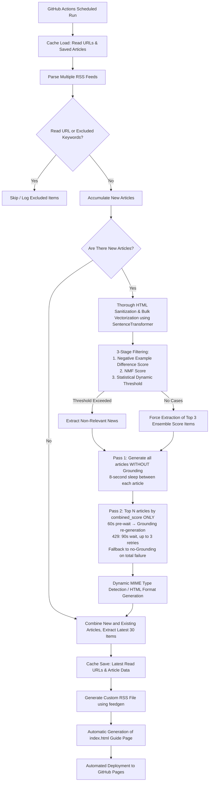

<h1 align="left">bubble-breaker</h1>

    <strong>A custom feed that automatically extracts news items outside users' interest domains (beyond their "filter bubbles") from specified news media RSS feeds, then structures and delivers them using LLM (Gemini API)</strong>

  
  
  
  
  
  

日本語版はこちら → [README.ja.md](README.ja.md)

## 1. System Overview

This system is designed to break through the filter bubble effect (the algorithmic bias toward users' existing interests) in modern information consumption by implementing an inverse filtering approach to news delivery.

Utilizing user-defined "interest clusters" and "non-interest clusters," the system employs a three-stage filtering process: ① `negative cluster difference scoring`, ② `NMF topic modeling`, and ③ `statistical dynamic thresholding`, to identify and extract news articles that fall outside users' areas of interest.

The selected articles are then processed using LLM technology to: rewrite titles, structure the content into four sections ("What Happened," "Background," "Implications," and "Relevance to Interests"), and distribute them via GitHub Pages as both a new RSS feed (XML format) and an index page.

> [!WARNING]
> The LLM-generated explanations and summaries produced by this system are intended primarily as "introductions" and "supplements" to help users develop interest or understanding in fields outside their expertise.
> While efforts have been made to improve factual accuracy through techniques like Google Search Grounding, there may be instances of hallucination characteristic of LLM outputs.
> **For precise factual information and details, please always verify by reading the original news articles (source materials) linked within the feed.**

## 2. System Flow

🔍 <b>Click to view the system flow diagram</b>

## 3. Key Features

* **Advanced 3-Stage Inverse Filtering Algorithm**

    Rather than relying on simple text comparison, the system achieves high-precision filtering of irrelevant content by ensembling three metrics: the similarity difference between "interest" and "non-interest" clusters (Negative Example Difference), Latent Topic Analysis using NMF (Non-negative Matrix Factorization), and a statistical dynamic threshold based on the formula `mean + K_SIGMA*std`.

* **Selective Contextual Supplementation via Google Search Grounding**

    To minimize API quota consumption, the system adopts a two-pass architecture. Pass 1 generates all articles without Grounding for stable, fast processing. Pass 2 then selectively applies Grounding only to the top N articles (default: 2) by combined_score, after a 60-second pre-wait to allow quota recovery. If a 429 error occurs during Grounding, the system waits 90 seconds and retries up to 3 times. If all attempts fail, it falls back gracefully to the Pass 1 result.

* **Persistent Feed Maintenance via Caching**

    Utilizing `actions/cache`, the system persists processed URLs (up to 500) and generated article data in JSON format. This prevents redundant processing while maintaining a constant stream of the latest 30 articles, ensuring stable feed delivery even when no new content is ingested.

* **Robust Error Handling & API Rate Limit Management**

    Pass 1 inserts an 8-second sleep between articles to avoid rate limit violations. Pass 2 applies a 60-second pre-wait before each Grounding attempt. For non-Grounding generation, `tenacity` implements exponential backoff with up to 5 automatic retries. In the event of total generation failure, the system falls back to summarizing the original article, ensuring continuous operation.

* **Optimized RSS Presentation**

    Each article summary explicitly includes the source name and similarity scores (interest similarity, differential score, combined score). Articles processed with Grounding are labeled with a badge. The system features robust `enclosure` support with dynamic MIME type detection for image URLs and inline CSS for HTML readability optimization.

## 4. Technical Stack

* Programming Language: Python 3.10
* LLM SDK: google-genai
* Generation Model: gemini-3.1-flash-lite (Google Search Grounding selectively applied to top N articles)
* Embedding Model: sentence-transformers (intfloat/multilingual-e5-small)
* Retry Control: tenacity
* RSS Parsing/Generation: feedparser, feedgen
* Infrastructure: GitHub Actions for CI/CD and GitHub Pages for static hosting

## 5. Repository Structure

* `main.py`: The main script that handles the entire pipeline from RSS retrieval, filtering, LLM explanation generation, and file output. Built with `Article` / `ScoredArticle` / `ProcessedArticle` dataclasses and a centralized `CONFIG` dict for readability and maintainability.
* `processed_urls.json`: A cache file automatically generated to store a list of read URLs and the most recent output articles
* `requirements.txt`: List of dependency packages
* `.github/workflows/generate-rss.yml`: GitHub Actions configuration file for scheduled execution and cache management

## 6. Setup Instructions

1. **Repository Preparation**

   Clone or fork this repository to your own GitHub account.

2. **Obtaining API Keys and Tokens**

   * Retrieve your Gemini API key from [Google AI Studio](https://aistudio.google.com/).
   * Obtain an Access Token (with Read permissions) from [Hugging Face](https://huggingface.co/settings/tokens).

3. **Configuring GitHub Secrets**

   In your GitHub repository, go to `Settings` > `Secrets and variables` > `Actions` and add the following environment variables:
   * `API_KEY1`: Your obtained Gemini API key
   * `HF_TOKEN1`: Your obtained Hugging Face token

4. **Enabling GitHub Pages**

    In your GitHub repository, navigate to `Settings` > `Pages` and properly configure the Build and deployment Source to "GitHub Actions" or similar settings.

5. **Customizing Source Code**

    Please customize the `CONFIG` dict at the top of `main.py` and the following constants according to your needs:

   * `SOURCE_RSS_URLS`: List of RSS URLs for news sources you want to fetch
   * `INTEREST_TEXTS`: Your current areas of interest (interest clusters)
   * `DISINTEREST_TEXTS`: Areas you want to avoid (non-interest clusters)
   * `EXCLUDE_KEYWORDS`: List of keywords to filter out paid articles, etc.
   * `CONFIG["filter_k_sigma"]` / `CONFIG["filter_n_topics"]`: Adjust statistical thresholds and number of NMF topics for filtering
   * `CONFIG["max_grounded"]` / `CONFIG["grounding_wait_sec"]`: Adjust the number of articles to Grounding and the pre-wait duration

## 7. Usage Instructions

Upon successful completion of the GitHub Actions workflow, the project will be automatically deployed to the GitHub Pages environment, generating an index page (index.html) accessible at the following URL:

`https://[your-github-username].github.io/[repository-name]/`

Please subscribe to this project by registering the rss.xml file in the same directory with any RSS reader application, such as Feedly or NetNewsWire.

## LICENSE

MIT
