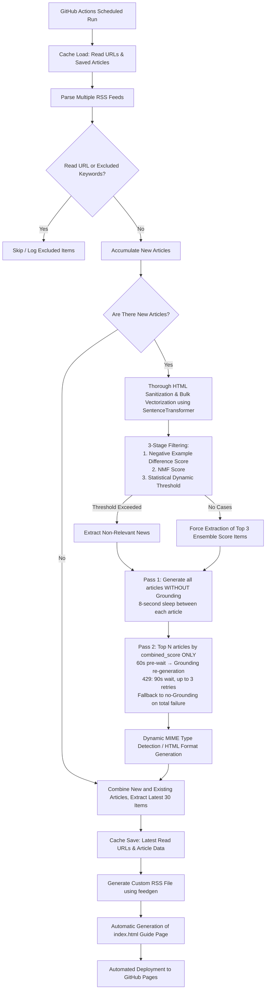

<h1 align="left">bubble-breaker</h1>

<p align="left">
    <strong>A custom feed that automatically extracts news items outside users' interest domains (beyond their "filter bubbles") from specified news media RSS feeds, then structures and delivers them using LLM (Gemini API)</strong>
</p>

<p align="left">
  <a href="https://www.python.org/downloads/release/python-3100/">
    
  </a>
  <a href="https://github.com/ph-cookie/bubble-breaker/actions">
    
  </a>
  <a href="https://ph-cookie.github.io/bubble-breaker/">
    
  </a>
  <a href="https://aistudio.google.com/">
    
  </a>
  <a href="https://huggingface.co/intfloat/multilingual-e5-small">
    
  </a>
  <a href="https://opensource.org/licenses/MIT">
    
  </a>
</p>

日本語版はこちら → [README.ja.md](README.ja.md)


## 1. System Overview

This system is designed to break through the filter bubble effect (the algorithmic bias toward users' existing interests) in modern information consumption by implementing an inverse filtering approach to news delivery.

Utilizing user-defined "interest clusters" and "non-interest clusters," the system employs a three-stage filtering process: ① `negative cluster difference scoring`, ② `NMF topic modeling`, and ③ `statistical dynamic thresholding`, to identify and extract news articles that fall outside users' areas of interest.

The selected articles are then processed using LLM technology to: rewrite titles, structure the content into four sections ("What Happened," "Background," "Implications," and "Relevance to Interests"), and distribute them via GitHub Pages as both a new RSS feed (XML format) and an index page.

> [!WARNING]
> The LLM-generated explanations and summaries produced by this system are intended primarily as "introductions" and "supplements" to help users develop interest or understanding in fields outside their expertise.
> While efforts have been made to improve factual accuracy through techniques like Google Search Grounding, there may be instances of hallucination characteristic of LLM outputs.
> **For precise factual information and details, please always verify by reading the original news articles (source materials) linked within the feed.**

## 2. System Flow

<details>
<summary style="color: #666; font-size: 0.9em; cursor: pointer;">
🔍 <b>Click to view the system flow diagram</b>
</summary>



</details>

## 3. Key Features

* **Advanced 3-Stage Inverse Filtering Algorithm**

    Simply selecting articles that are "far from areas of interest" leads to frequent misclassification, because generic terms like "company," "change," and "problem" appear in both IT articles and political articles. To address this, three complementary metrics are combined:

    | # | Metric | What it measures | Problem it solves |
    |---|--------|-----------------|-------------------|
    | 1 | **Negative Example Difference Score** | Quantifies "non-interest orientation" as the difference in similarity toward both interest and non-interest clusters | Cancels out misclassification from generic terms through positive/negative contrast |
    | 2 | **NMF Score** | Identifies which latent topic groups an article belongs to, as discovered by cross-analyzing all articles | Supplements contextual and thematic characteristics that are difficult to capture at the word level |
    | 3 | **Statistical Dynamic Threshold** | Evaluates each article's relative position within the current run's score distribution | Maintains consistent extraction accuracy regardless of daily variation in news volume or topic distribution |

    By combining these into an ensemble score, the system accurately identifies articles that are "superficially similar to IT content but on an entirely different topic" — cases that a single metric would likely miss.

    <details>
    <summary style="color: #666; font-size: 0.9em; cursor: pointer; margin-top: 0.5em;">
    🔍 <b>Detailed explanation of each filter</b>
    </summary>

    **STEP 1 ｜ Difference Score via Vector Similarity**

    Article text is vectorized using the multilingual embedding model (`multilingual-e5-small`). Cosine similarity is then computed against both `INTEREST_TEXTS` (interest clusters) and `DISINTEREST_TEXTS` (non-interest clusters), which are defined in advance.

    ```
    Difference Score = max(similarity to non-interest clusters) − max(similarity to interest clusters)
    ```

    A higher value indicates that the article is "more non-interest oriented and less interest oriented." Rather than measuring distance from interest clusters alone, taking the difference in both directions suppresses misclassification caused by generic terms like "company," "change," and "problem" that appear frequently in both IT and political articles.

    ---

    **STEP 2 ｜ Latent Topic Score via NMF**

    All article texts are converted into a TF-IDF matrix using character n-grams (2–3 characters), then decomposed into N latent topics using NMF (Non-negative Matrix Factorization). NMF is a technique that factorizes a matrix into the product of a "topic-word relationship matrix" and an "article-topic relationship matrix." Each topic is automatically discovered as a cluster of terms that tend to co-occur within the article corpus.

    The representative terms of each topic are then vectorized using the embedder, and their cosine similarity to `INTEREST_TEXTS` is computed. The inverse of this value (`1 − similarity`) is treated as the "non-interest degree" of each topic. The NMF score for each article is computed as the weighted average of this non-interest degree across all topics, weighted by the article's topic membership proportion.

    ```
    Non-interest degree of topic k  = 1 − max(cosine similarity to INTEREST_TEXTS)

    NMF score of article i          = Σ (proportion of topic k in article i × non-interest degree of topic k)
                                          k
    ```

    While STEP 1 evaluates each article individually through direct vectorization, STEP 2 evaluates articles through the lens of latent topic structures discovered by cross-analyzing the entire article corpus. Together, they capture both word-level similarity and structural thematic differences.

    ---

    **STEP 3 ｜ Selection via Statistical Dynamic Threshold**

    The scores from STEP 1 and STEP 2 are each transformed to the 0–1 range using the sigmoid function (sigmoid is used instead of min-max normalization to preserve the zero reference point of the difference score), then combined with weighting parameters α and β.

    ```
    Final Score = α × STEP 1 Score + β × STEP 2 Score
    ```

    **On α and β:** These weights represent the contribution of STEP 1 and STEP 2, respectively. The default is equal weighting (α = β = 0.5). If the difference score feels more accurate, increase α; if NMF feels more effective, increase β. Keeping the sum at 1.0 is recommended.

    Next, the mean (μ) and standard deviation (σ) of the final scores across all articles are computed, and the threshold is determined dynamically.

    ```
    Threshold = μ + K × σ
    ```

    **On K:** This parameter controls the strictness of the threshold. With the default (K = 0.5), articles whose score is 0.5σ or more above the mean are selected for extraction. A larger K means stricter selection with fewer articles extracted; a smaller K means more lenient selection with more articles. Because the threshold is derived from the statistics of the current run's article corpus rather than a fixed value, stable extraction is maintained even as daily news volume and topic distribution vary.

    </details>

* **Selective Contextual Supplementation via Google Search Grounding**

    To minimize API quota consumption, the system adopts a two-pass architecture. Pass 1 generates all articles without Grounding for stable, fast processing. Pass 2 then selectively applies Grounding only to the top N articles (default: 2) by combined_score, after a 60-second pre-wait to allow quota recovery. If a 429 error occurs during Grounding, the system waits 90 seconds and retries up to 3 times. If all attempts fail, it falls back gracefully to the Pass 1 result.

* **Persistent Feed Maintenance via Caching**

    Utilizing `actions/cache`, the system persists processed URLs (up to 500) and generated article data in JSON format. This prevents redundant processing while maintaining a constant stream of the latest 30 articles, ensuring stable feed delivery even when no new content is ingested.

* **Robust Error Handling & API Rate Limit Management**

    Pass 1 inserts an 8-second sleep between articles to avoid rate limit violations. Pass 2 applies a 60-second pre-wait before each Grounding attempt. For non-Grounding generation, `tenacity` implements exponential backoff with up to 5 automatic retries. In the event of total generation failure, the system falls back to summarizing the original article, ensuring continuous operation.

* **Optimized RSS Presentation**

    Each article summary explicitly includes the source name and similarity scores (interest similarity, differential score, combined score). Articles processed with Grounding are labeled with a badge. The system features robust `enclosure` support with dynamic MIME type detection for image URLs and inline CSS for HTML readability optimization.

## 4. Technical Stack

* Programming Language: Python 3.10
* LLM SDK: google-genai
* Generation Model: gemini-3.1-flash-lite (Google Search Grounding selectively applied to top N articles)
* Embedding Model: sentence-transformers (intfloat/multilingual-e5-small)
* Retry Control: tenacity
* RSS Parsing/Generation: feedparser, feedgen
* Infrastructure: GitHub Actions for CI/CD and GitHub Pages for static hosting

## 5. Repository Structure

* `main.py`: The main script handling the entire pipeline from RSS retrieval, filtering, LLM explanation generation, and file output. Built with `Article` / `ScoredArticle` / `ProcessedArticle` dataclasses and a centralized `CONFIG` dict for readability and maintainability.
* `processed_urls.json`: A cache file automatically generated to store a list of read URLs and the most recent output articles
* `requirements.txt`: List of dependency packages
* `.github/workflows/generate-rss.yml`: GitHub Actions configuration file for scheduled execution and cache management

## 6. Setup Instructions

1. **Repository Preparation**

   Clone or fork this repository to your own GitHub account.

2. **Obtaining API Keys and Tokens**

   * Retrieve your Gemini API key from [Google AI Studio](https://aistudio.google.com/).
   * Obtain an Access Token (with Read permissions) from [Hugging Face](https://huggingface.co/settings/tokens).

3. **Configuring GitHub Secrets**

   In your GitHub repository, go to `Settings` > `Secrets and variables` > `Actions` and add the following environment variables:
   * `API_KEY1`: Your obtained Gemini API key
   * `HF_TOKEN1`: Your obtained Hugging Face token

4. **Enabling GitHub Pages**

    In your GitHub repository, navigate to `Settings` > `Pages` and properly configure the Build and deployment Source to "GitHub Actions" or similar settings.

5. **Customizing Source Code**

    Please customize the `CONFIG` dict at the top of `main.py` and the following constants according to your needs:

   * `SOURCE_RSS_URLS`: List of RSS URLs for news sources you want to fetch
   * `INTEREST_TEXTS`: Your current areas of interest (interest clusters)
   * `DISINTEREST_TEXTS`: Areas you want to avoid (non-interest clusters)
   * `EXCLUDE_KEYWORDS`: List of keywords to filter out paid articles, etc.
   * `CONFIG["filter_k_sigma"]` / `CONFIG["filter_n_topics"]`: Adjust statistical thresholds and number of NMF topics for filtering
   * `CONFIG["max_grounded"]` / `CONFIG["grounding_wait_sec"]`: Adjust the number of articles to Grounding and the pre-wait duration

## 7. Usage Instructions

Upon successful completion of the GitHub Actions workflow, the project will be automatically deployed to the GitHub Pages environment, generating an index page (index.html) accessible at the following URL:

`https://[your-github-username].github.io/[repository-name]/`

Please subscribe to this project by registering the rss.xml file in the same directory with any RSS reader application, such as Feedly or NetNewsWire.

## LICENSE

MIT
